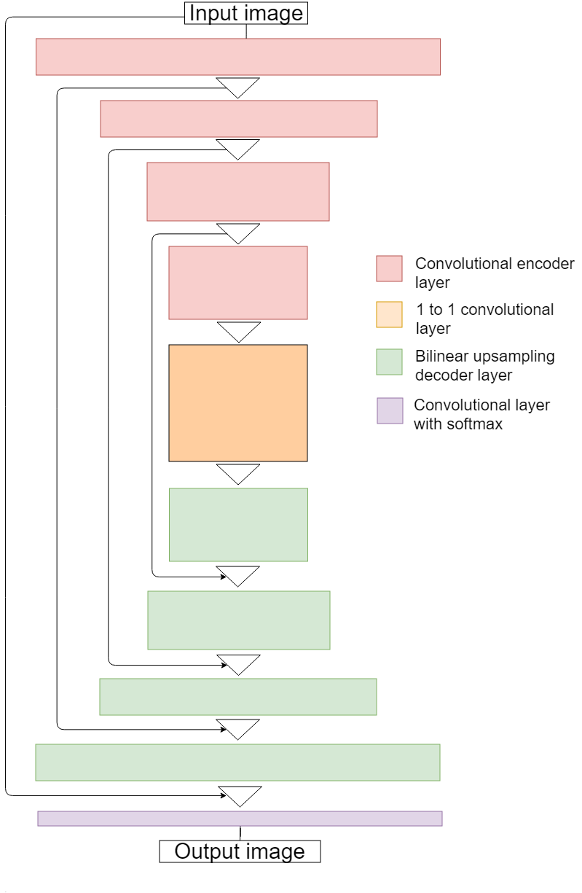

## Project: Follow Me
---

# Required Steps for a Passing Submission:

1. Clone the project repo here
2. Fill out the TODO's in the project code as mentioned here
3. Optimize your network and hyper-parameters.
4. Train your network and achieve an accuracy of 40% (0.40) using the Intersection over Union IoU metric which is final_grade_score at the bottom of your notebook.
5. Make a brief writeup report summarizing why you made the choices you did in building the network.

## [Rubric](https://review.udacity.com/#!/rubrics/1067/view) Points
### Here I will consider the rubric points individually and describe how I addressed each point in my implementation.  

---
### Writeup / README

#### 1. Provide a Writeup / README that includes all the rubric points and how you addressed each one.  You can submit your writeup as markdown or pdf.  

You're reading it!

#### 2. The write-up conveys the an understanding of the network architecture.

The chosen network architecture can be seen it the figure.

The layers of the network are explained below:
##### 1. Encoder block

This is a convolutional block. It consists of 4 layers. Each of these layers uses 3d kernels (filters) of shape [3,3,input_depth] to extract features from the image. Number of those kernels is equla to the output depth of the layer. 

When kernel swipes the input image, it is shifted by 2 units (pixels) for every pixel of the output image, therefor each output image is aproximately (depends on padding) 2x smaller (hight and width). The depth of the image increases and is equal to the number of kernels used. 

In those layers, separable convolutions are used - every layer of input image is swept with its own 3x3x1 kernel resulting in image with reduced width and height but same depth, than [1x1xinput_depth] kernales are used to extract features. The number output layers is equal to the number of [1x1xinput_depth] kernels. This approach significantly reduces the number of model parameters.

##### 2. 1 to 1 block

This is also a convolutional layer, but its kernel is {1x1xinput_depth] and the strides are equal to 1. Therefore the size (depth and width) of input and output are the same. Its purpouse is similar to fully connected layer in standard convolutional layer but it is pixel-wise therefor it preserves spatial information.

##### 3. Decoder block

The pourpouse of this layer is to upsample the image back to the original size. It uses transpose of the original convolutional layer. Also, while upsampling the image, similar size images from encoding steps are concatenated. This allows better resolution of the overal respones. At the end it uses softmax functionto change the range to the probability scale (probabilitie for all the classes sums to one)

The exact architecture of the network can be seen in `model_training.ipynb` file.

#### 3. The write-up conveys the student's understanding of the parameters chosen for the the neural network.

The chosen parameters are:

learning_rate = 0.004 (Making this parameter smaller allowed to obtain better solution but it also increases number of epochs needed for the solution to converge)

batch_size = 100 (This is a number of images used for every step of training, higher numbers exceed computer ram memory)

num_epochs = 100 (How many times to go through the whole dataset. 100 allowed loss function to converge)

steps_per_epoch = 42 (Steps taken in every epoch. It was set that algorithm goes through the whole dataset in every epoch)

validation_steps = 12 (To go throgh the whole validation dataset)

workers = 2 (depends on computer architecture)

#### 4. The student has a clear understanding and is able to identify the use of various techniques and concepts in network layers indicated by the write-up.

Explained in pt. 2 (network architecture)

#### 5. The student has a clear understanding of image manipulation in the context of the project indicated by the write-up.

Encoding with fully connected layes allows for recognition of objects in the picture. If two objects, that we trained the network for are in the picture than only one of them will have the highest probability and is detected.

Fully convolutional network (with decoder) perforems identification pixel-wise and can detect multiple objects and show their spatial locations.

#### 6. The student displays a solid understanding of the limitations to the neural network with the given data chosen for various follow-me scenarios which are conveyed in the write-up.

The network can only work for the classes of objects that it was traind for. The training set should include the whole spectrum of objects in the triand class (varius distances to the object, various typs of the objects of a particular class, varius orintations and positions) as well as the data without object of this particular class. Wy can use the same same network architecture to detct dogs/cats bat we would to use extended dataset.

### Model

The file are supplied in the data/weights folder. Tha accuracy obtaind wa equal to 44%.

Exercise 1, 2 and 3 pipeline implemented
#### 1. Complete Exercise 1 steps. Pipeline for filtering and RANSAC plane fitting implemented.
The purpouse of the exercise was to limit the ammount of point cloud data to voxels that are needed for object recognition. Firstly the data is downsampled to a leaf (voxel) size of 1x1x1 cm. Than all the unwanted data below the table is removed with passthrough filter. At the end RANSAC filter is used to find a flat surface (the table). The rest of the data (the outlier) assigned to a variable for further proccesci (clustering).

#### 2. Complete Exercise 2 steps: Pipeline including clustering for segmentation implemented.  
During this exercise, one was suppouse to perform clustering of the cloud remaining from the ex. 1. In order to achive that, euclidean clustering was implemented, which separates pointclouds based on voxel distance. If the distance of voxels were smaller than 5 cm, it was assumed that they belong to the same object. Aditinaly it was assumed that the cluster in not smaller than 100 voxels and not bigger than 10000. To visualize the clustering procces, the voxels belonging to different clusters were colored with different colours and published to /points topic.

#### 3. Complete Exercise 3 Steps.  Features extracted and SVM trained.  Object recognition implemented.
Functions: `compute_color_histograms` and `compute_normal_histograms` were fiiled to capture  fatures. In `object_rocogintion.py` script,code was added to convert ros message to pcl object and concatenate normals and color histograms into one feature vector. Number of beans for color and normal histograms was adjusted to improved performance. 32 bins were used for color (for each HSV component) and 20 bins for normals (for each component: X,Y,Z). For each indentified object 40 orientations were used to build the training set. The results of SVM model validation can be seen in the following image. 

### Pick and Place Setup

#### 1. For all three tabletop setups (`test*.world`), perform object recognition, then read in respective pick list (`pick_list_*.yaml`). Next construct the messages that would comprise a valid `PickPlace` request output them to `.yaml` format.
The functionlity was implemented in `percep.py` script based on `project_template.py`. Most of the code from ex. 1-3 was reused in unchanged form. Statistical outlier filtering was implemented to remove noise. Average of 3 voxel distances was used in the filter. All voxels that had higher 3 voxels distance than mean for all the voxels were removed. 

The passthrough filter was modified to account for different table hight. Additonal y-axis passthrough filter was use to further reduce the scene.

Next objects were rocognized similarly as in ex. 3.

Centers of each detected objects were computed. Based on supplied pick list, arm was assesed for every object as well as place pose. The data was than converted to ros style message in the form required by ros service. The messages were packed into dictionalry variable and writen into yaml files. One `output_*.yaml` file for each world. 

All the found objects in scenes 1-3 were recognized but algorithm could not find glue in the scene 3 as it was partially covered by another object. Possibly improving clastering algoritm (mayby smller cluster tollerance) would enable better cluster distinction.

Screenshots of all 3 interpreted worlds can be found in `scenes` folder.

